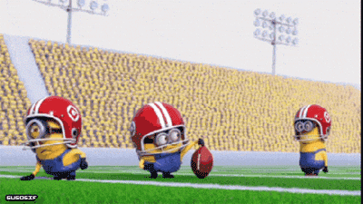

## Outline

1. Introduction and Review (8-9 / 49)
   - background
   - methods
	 - rq (freq)
	 - Bayesian
	   - ALD
       - DP, PT, median
       - ALD mixture parametrization
	   - g-priors
       - ALD MLE method
   - review background of missingness longitudinal settings and problem
	 - monotone missingness
   - outline of our proposal
2. BQRPT (8/49)
   - intuition
   - Methods
   - PT Introduction
   - PT parameters
   - Results
3. QRMissing (19/49)
   - Methods
   - Results
4. Future Work, 3rd chapter (9/49)
5. References

---

## Introduction of Quantile Regression

### Quantile

\[
Q_{Y}(\tau) = \inf \{y: F(y) \geq \tau \},
\]

### Quantile Regression

\[
Q_{Y}(\tau|\mathbf x) = \mathbf x' \beta(\tau).
\]

--- &twocol

## Quantile Regression vs Mean Regression

*** left

1. More information about the relationship of covariates and responses
2. Slope varies
3. Estimates of interest

*** right

* more complete description of the conditional distribution

---

## Methods

* Freq
    - R package `quantreg`
    - using simplex for linear programming problems mentioned in Koenker 1987

* Bayesian

	- ALD, Yu & Moyeed (2001)
	- median regression( a special case of quantile regression), non-parametric
modeling for the error distribution based on either PT or DP priors
	- Kottas & Krnjajic (2009): semi-parametric models using DP mixtures for
the error distribution
	- Kozumi & Kobayashi (2011) developed a simple and efficient Gibbs sampling algorithm for fitting quantile regression based on a location-scale mixture representation of ALD
	- Sanchez et al (2013) efficient and easy EM algorithm to obtain MLE for ALD settings from the hierarchical representation of ALD

--- &twocol

## Traditional Frequentist Method

*** left

Method: using linear programming

- cite Koenker 2005,

\[
\mathbf \beta(\tau) = \arg \min \sum_{i=1}^{n} \rho_{\tau}(y_{i} - \mathbf x_{i}' b)^2
\]

* why

The loss function:

\[
\rho_{\tau}(x) = x(\tau - I(x < 0))
\]

Optimization problem for the loss function with quantile:

\[
E \rho_{\tau} (X - \hat{x}) \implies F(\hat{x}) = \tau
\]

*** right

If $F$ is replaced by the empirical distribution function:

\[
F_n(x) = n^{-1} \sum_{i=1}^n I(X_i \leq x)
\]

Then (2) changes to minimizing

\[
\int \rho_\tau(X-\hat{x}) d \, F_n(x) = n^{-1} \sum_{i=1}^n \rho_\tau(X_i - \hat{x}
\]

--- &twocol

## Analog from mean regression

*** left

* sample mean

\[ \min_{\mu \in \mathbb{R}} \sum_{i=1}^n (y_i - \mu)^2 \]

* least square mean regression

\[ \min_{\beta \in \mathbb{R}^p} \sum_{i=1}^n (y_i - \mathbf x_i^T \beta)^2 \]

*** right

* $\tau^{th}$ sample quantile

\[ \min_{\alpha \in \mathbb{R}} \sum_{i=1}^n \rho_\tau(y_i - \alpha) \]

* $\tau^{th}$ quantile regression

\[ \min_{\beta \in \mathbb{R}^p} \sum_{i=1}^n \rho_\tau(y_i - \mathbf x_i^T \beta) \]

---

## Pros and Cons of Frequentist Way

* No distributional assumptions
* Fast using linear programming
* asymptotic inference may not be accurate for small sample sizes
* easy to derivatives:
  * random effect
  * l1 , l2 penalty

---

## Bayesian Approach: Asymmetric Laplace Distribution

\[f_{\epsilon}(x) \sim ALD
\]

- Yu and Moyeed: ALD
- Walker and Mallick (1999) diffuse finite Polya Tree
- Kottas and Gelfand : two families of median zero distribution
- Hanson and Johnson (2002) mixture of polya tree prior for median regression on survival time in AFT model
- Reich (2010) uses an infinite mixture of Gaussian densities for error
- Others include quantile pyramid priors, mixture of Dirichlet process priors of multivariate
  distributions and infinite mixture of Gaussian densities which put quantile constraints on the
  residuals (Hjort and Petrone 2007, Hjort and Walker 2009, Kottas and Krnjajic 2009)

---

## ALD (Yu & Moyeed (2001))

 Definition:

A random variable $Y$ is distributed as an Asymmetric Laplace Distribution with
location parameter $\mu$, scale parameter $\sigma > 0$ and skewness parameter
$\tau \in (0, 1)$ if its pdf is given by

\[
f(y|\mu, \sigma, \tau) = \frac{\tau (1 - \tau)}{\sigma} \exp \left\{ - \rho_{\tau}
\left( \frac{y  - \mu}{ \sigma} \right) \right\}.
\]

where $\rho_\tau (.)$ is the check (or loss) function

Property of $ALD(\mu, \sigma, \tau)$:

- mode at $\mu$
- $P_Y(Y \le \mu) = \tau$

---

## Mixture representation of ALD for efficient Gibbs sampling

---

## DP, PT, mixture of DP and PT

---

## Common

- mode at quantile
- single quantile regression
- densities have their restrictive mode at the quantile of interest,
  which is not appropriate when extreme quantiles are being investigated
- quantile lines monotonicity constraints and difficulty in making inference for quantile
  regression parameters for an interval
- Joint inference is poor in borrowing information through single quantile regressions
- not coherent to pool from every individual quantile regression, because the sampling distribution of $Y$ for $\tau_1$
  is usually different from that under quantile $\tau_2$ since they are assuming different error distribution
  under two different quantile regressions (Tokdar and Kadane, 2011)

---

## Solution

- Tokdar and Kadane 2011: simultaneous linear quantile regression
- non-parametric model for the error term (density estimation) to avoid the monotonicity problem (Scaccia and Green 2003,
  Geweke and Keane 2007, Taddy and Kottas 2010)

---

## Background of missing data

---

## Goals of the Dissertation

---

## Bayesian Quantile Regression Using Polya Trees Priors

- [ ] May insert a Polya Tree picture here

---

## Intuition

Consider heterogeneous linear regression model from He et al (1998):

\[ y_i = \mathbf x_i \mathbf \beta + (\mathbf{x_i \gamma} )\epsilon_i \]

The $\tau^{th}$ quantile regression parameters is

\[ \mathbf \beta(\tau) = \mathbf \beta + F^{-1}_\epsilon (\tau) \mathbf \gamma
\]

- Homogeneous model ($\mathbf \gamma = (1, \mathbf 0)$): parallel quantile lines
- Heterogeneous model ($\mathbf \gamma \neq (1, \mathbf 0)$): non-parallel quantile lines
- Heterogeneous linear regression model allows non-parallel quantile lines
- [ ] Illustrate with 2 pictures

---

## Idea

\[ y_i = \mathbf x_i \mathbf \beta + (\mathbf{x_i \gamma} )\epsilon_i \]

\[ \mathbf \beta(\tau) = \mathbf \beta + F^{-1}_\epsilon (\tau) \mathbf \gamma \]

- Estimate $\mathbf \beta, \mathbf \gamma, F^{-1}_\epsilon(\tau) |\mathbf Y$, then $\mathbf \beta(\tau) | \mathbf Y$
- Use mixture of Polya Tree priors to nonparametrically estimate  $F^{-1}_\epsilon(\tau) |\mathbf Y$
- Closed form for predictive quantile regression parameters
- Polya tree is a very flexile way to model the unknown distribution
- Exact inference through MCMC and fewer assumptions

---

## Polya Tree Definition

- Polya Tree priors were introduced decades ago (Freedman 1963, Fabius 1964, Ferguson 1974)
- Lavine (1992, 1994) extended to Polya Tree models, completed definitions, and introduced how
  to sample from Polya Trees
- Advantage over Dirichlet process:
  - can be absolutely continuous with probability 1
  - can be easily tractable
  - Dirichlet process is just a special case of Polya Tree

---

## Basic

Denote

- $E=\{0,1\}$
- $E^m$ as the m-fold product of $E$
- $E^0 = \emptyset$
- $E^* = \cup_0^\infty E^m$
- $\Omega$ be a separable measurable space
- $\Pi_0 = \Omega$
- $\Pi=\{\Pi_m: m=0,1,...\}$ be a separating binary tree of partitions of $\Omega$
- $B_{\emptyset} = \Omega$
- $\forall \epsilon=\epsilon_1\cdots \epsilon_m \in E^{*}$, $B_{\epsilon 0}$ and
$B_{\epsilon 1}$ are the two partition of $B_{\epsilon}$.

---

## Definition (continue)

 Polya Tree: 

A random probability measure $G$ on $(\Omega, \mathcal{F})$ is said to have a Polya
tree distribution, or a Polya tree prior with parameter $(\Pi, \mathcal{A})$, written
as $G|\Pi, \mathcal{A} \sim PT (\Pi, \mathcal{A})$, if there exists nonnegative number
$\mathcal{A} = \left\{ \alpha_\epsilon, \epsilon \in E^* \right \}$ and random vectors
$\mathcal{Y} = \{ Y_\epsilon : \epsilon \in E^* \}$ such that the following hold:

- all the random variables in $\mathcal{Y}$ are
    independent;
- $Y_{\epsilon}= (Y_{\epsilon 0}, Y_{\epsilon 1}) \sim
    \mathrm{Dirichlet}(\alpha_{\epsilon 0 }, \alpha_{\epsilon 1}),
    \forall \epsilon \in E^{*}$;
- $\forall m=1,2, \ldots$, and $\forall \epsilon \in E^{*},
    G(B_{\epsilon_{1}, \ldots, \epsilon_m}) = \prod_{j=1}^m
    Y_{\epsilon_1 \cdots \epsilon_j}$.

---

## Polya Tree Parameters ($\mathcal{A}$)

Usually a Polya tree is centered around a
pre-specified distribution $G_0$, which is called the baseline
measure.

$\mathcal{A}$ determines how much $G$ can deviate from $G_0$.

- Ferguson (1974) pointed out $\alpha_{\epsilon} = 1$ yields a $G$ that is absolutely continuous with probability 1
- $\alpha_{\epsilon_1, \ldots, \epsilon_m} = m^2$ yields $G$ that is
absolutely continuous with probability 1.
- Walker and Mallick (1999) and
 Paddock (1999) considered $\alpha_{\epsilon_1, \ldots,
  \epsilon_m} = cm^2$, where $c > 0$.
- Berger and Guglielmi (2001) considered
$\alpha_{\epsilon_1, \ldots, \epsilon_m} = c \rho(m)$. In general, any
$\rho(m) $ such that $\sum_{m=1}^{\infty} \rho(m)^{-1} < \infty$
guarantees $G$ to be absolutely continuous.
- In our case, we adopt $\alpha_{\epsilon_1, \ldots, \epsilon_m} = cm^2$.
- $m$ is the number of levels

---

## Polya Tree Parameters ($\Pi$)

Partition parameter $\Pi$

- Pre-specified distribution $G_0$, baseline measure

- Canonical way of constructing a Polya Tree distribution $G$ centering on $G_0$

- $B_0 = G^{-1}_0 ([0, 1/2]), B_1 = G^{-1}_0 ((1/2,1])$

- $G(B_0) = G(B_1)= 1/2$

- $\forall \epsilon \in E^{*}$, choose
$B_{\epsilon 0 }$ and $B_{\epsilon 1}$ to satisfy
$G(B_{\epsilon 0 } |B_{\epsilon} ) = G(B_{\epsilon 1} | B_{\epsilon}) = 1/2$

- A simple example is to choose $B_{\epsilon 0}$ and $B_{\epsilon 1}$ in level $m$ by setting them as
$G^{-1}_0 \left((k/2^m, (k+1)/2^m] \right)$, for $k=0,..., 2^m-1$.

(*May show picture here*)

---

## Properties of Polya Tree

### Expectation of Polya Tree

Suppose $G \sim PT(\Pi, \mathcal{A})$ is a random probability
measure and $Y_1, Y_2, ...$ are random samples from $G$.

$F= E(G)$ as a probability measure is defined by
$F(B) = E(G(B)),\forall B \in \mathcal{B}$. By the definition of Polya tree, for
  any $\epsilon \in E^{*}$,
\[
    F(B_{\epsilon})  = E(G(B_{\epsilon})) = \prod_{j=1}^m
    \frac{\alpha_{\epsilon_1, \ldots, \epsilon_j}}{\alpha_{\epsilon_1,
        \ldots, \epsilon_{j-1},0} + \alpha_{\epsilon_1, \ldots, \epsilon_{j-1},1}}.
\]

If $G$ is constructed based on baseline measure $G_0$ and we set
$\alpha_{\epsilon_1, ..., \epsilon_m} = cm^2$,
$\alpha_{\epsilon_0 }= \alpha_{\epsilon_1}$, then
$\forall B \in \mathcal{B}, F(B) = G_0(B)$; thus, $F=G_0$, if there is no data.

---

## Density Function

Suppose $F=E(G), G|\Pi, \mathcal{A} \sim PT (\Pi, \mathcal{A})$,
where $G_0 $ is the baseline measure. Then, using the canonical
construction, $F=G_0$, the density function is

\[
f(y) = \left[ \prod_{j=1}^m \frac{ \alpha_{\epsilon_1, \ldots, \epsilon_j}(y)}{\alpha_{\epsilon_1, \ldots, \epsilon_{j-1},0}(y) +\alpha_{\epsilon_1, \ldots, \epsilon_{j-1},1}(y)} \right] 2^{m } g_0(y)
\]
where $g_0$ is the pdf of $G_0$.

When using the canonical construction with no data,
$\alpha_{\epsilon_0 } = \alpha_{\epsilon_1}$, above equation
simplifies to

\[
f(y) = g_0(y).
\]

---

## Conjugacy

If $y_1, ..., y_n | G \sim G, G|\Pi,\mathcal{A} \sim PT(\Pi, \mathcal{A})$,
then $G|y_1, ..., y_n, \Pi, \mathcal{A} \sim PT(\Pi, \mathcal{A}^{*})$, where in
$\mathcal{A}^{*}, \forall \epsilon \in E^{*}$,

\[
    \alpha_{\epsilon}^{*} = \alpha_{\epsilon} + n_{\epsilon}(y_1, \ldots, y_n),
\]
where $n_{\epsilon}(y_1, ..., y_n)$ indicates the count of how many
samples of $y_1, ..., y_n$ fall in $B_{\epsilon}$.

---

## Mixture of Polya Trees

- The behavior of a single Polya tree highly depends on how the
partition is specified.
- A random probability measure $G_\theta$ is
said to be a mixture of Polya tree if there exists a random
variable $\theta$ with distribution $h_{\theta}$, and Polya tree
parameters $(\Pi^{\theta}, \mathcal{A}^{\theta})$ such that

\[
$G_{\theta} | \theta=\theta \sim \pt (\Pi^{\theta}, \mathcal{A}^{\theta})$
\]

 Example:
Suppose $G_0 = \mathrm{N}(\mu, \sigma^2)$ is the baseline measure.
For $\epsilon \in E^{*}, \alpha_{\epsilon_m} = cm^2 $,
$\mathbf \theta = (\mu, \sigma, c)$ is the mixing index and the distribution on
$\Theta = (\mu, \sigma, c) $ is the mixing distribution.

- With the mixture of Polya tree, the influence of the partition is
lessened
- Inference will not be affected greatly by a single
Polya tree distribution.

---

## Predictive Error Density (1)

- Suppose $G_{\theta}$ is the baseline measure, $g_0(y)$ is the density
function.
- $\Pi^{\theta}$ is defined as
\[
B^{\theta}_{\epsilon_1, \ldots, \epsilon_m} = \left( G^{-1}_{\theta}
\left( \frac{k}{2^m} \right), G^{-1}_{\theta}\left( \frac{k+1}{2^m} \right) \right),
\]
where $k$ is the index of partition $\epsilon_1, \ldots, \epsilon_m$
in level $m$.
- $\mathcal{A}^c$ is defined as
\[
  \alpha_{\epsilon_1, \ldots, \epsilon_m} = cm^2.
\]
Therefore, the error model is
\[
\begin{aligned}
y_1, \ldots, y_n |G_{\theta} & \sim G, \\
G|\Pi^{\theta}, \mathcal{A}^{c} & \sim PT (\Pi^{\theta},
\mathcal{A}^{c}).
\end{aligned}
\]

---

## Predictive Error Density (2)

The predictive density function of $Y|y_1, \ldots, y_n, \theta$,
marginalizing out $G$, is
\[
  f_Y^{\theta} (y|y_1, \ldots, y_n)  = \lim_{m \to \infty} \left(
    \prod_{j=2}^m \frac{cj^2 + n_{\epsilon_1 \cdots \epsilon_j(x) }(y_1, \ldots, y_n)}{2cj^2
      + n_{\epsilon_1 \cdots \epsilon_{j-1}(x)}(y_1, \ldots, y_n)}
  \right)2^{m-1} g_0(y),
\]
where $n_{\epsilon_1 \cdots \epsilon_j(x) }(y_1, \ldots, y_n)$
denotes the number of observations $y_1, \ldots, y_n$ dropping in the
bin $\epsilon_1 \cdots \epsilon_j$ where $y$ stays in the level
$j$.

- If we restrict the first level weight as
$\alpha_0=\alpha_1=1$, then we only need to update levels beyond
the first level.

---

## Finite Polya Tree

- In practice, a finite $M$ level Polya Tree is usually adopted to
  approximate the full Polya tree, in which, only up to $M$ levels
  are updated.

- The corresponding predictive density becomes
\[
    f_Y^{\theta, M} (y|y_1, \ldots, y_n)  =  \left(
      \prod_{j=2}^M \frac{cj^2 + n_{\epsilon_1 \cdots \epsilon_j(x) }(y_1, \ldots, y_n)}{2cj^2
        + n_{\epsilon_1 \cdots \epsilon_{j-1}(x)}(y_1, \ldots, y_n)}
    \right)2^{M-1} g_0(y).
\]

- The rule of thumb for choosing $M$ is to set $M=\log_2n$, where $n$
  is the sample size (Hanson et al 2002)

- <a href="">Hanson & Johnson (2002)</a> showed the approximation
is exact for $M$ large enough.

---
## Predictive Cumulative Density Function

Based on the predictive density function of a
finite \polya{} tree distribution, the predictive cumulative density
function is
\[
    F^{\theta,M}_Y(y|y_1, \ldots, y_n) = \sum_{i=1}^{N-1} P_{i} + P_N
    \left( G_{\theta}(y)2^M -(N-1) \right),
\]
where
\[
\begin{aligned}
    P_i &= \frac{1}{2} \left(\prod_{j=2}^M \frac{cj^2 + n_{j,\lceil
          i2^{j-M} \rceil}(y_1, \ldots, y_n)}{2cj^2 + n_{j-1,\lceil
          i2^{j-1-M} \rceil}(y_{1 },\ldots, y_n)} \right) \mbox{ and}\\
    N & = \left[ 2^{M } G_{\theta}(y) +1\right],
\end{aligned}
\]
in which $n_{j,\lceil i2^{j-M} \rceil}(y_1, \ldots, y_n)$ denotes
the number of observations $y_1, \ldots, y_n$ in the $\lceil
  i2^{j-M} \rceil$ slot at level $j$, $\lceil \cdot \rceil$ is the
  ceiling function, and $[ \cdot ]$ is the floor function.

---

## Predictive Error Quantiles

- The posterior predictive quantile of finite \polya{} tree
distribution is
\[
    Q^{\theta, M}_{Y|y_1, \ldots, y_n}(\tau) = G^{-1}_{\theta} \left(
      \frac{\tau- \sum_{i=1}^N P_i + N P_N}{2^M P_N} \right),
\]
where $N$ satisfies $\sum_{i=1}^{N-1} P_i < \tau \le \sum_{i=1}^N P_i$.

- The explicit form for quantile regression coefficients becomes:
\[
  \mathbf{\beta}(\tau) = \mathbf{\beta} + \mathbf{\gamma}G_{\theta}^{-1}
  \left(\frac{\tau - \sum_{i=1}^NP_i +
      NP_N}{2^MP_N}  \right),
\]

- Greatly facilitate computations

---

## Method
### Fully Bayesian Quantile Regression Specification with Mixture of \polya{} Tree Priors

The full Bayesian specification of quantile regression is given as
follows,
\[
\begin{align*}
  y_i& = \mathbf{x_i'\beta} + (\mathbf{x_i'\gamma}) \epsilon_{i}, i = 1,
  \ldots,
  n \\
  \epsilon_i |G_{\theta} & \sim G_{\theta} \\
  G_{\theta}|\Pi^{\theta}, \mathcal{A}^{\theta} & \sim PT
  (\Pi^{\theta}, \mathcal{A}^{\theta}) \\
  \mathbf{\theta} = (\sigma, c) & \sim \pi_{\mathbf \theta}(\mathbf \theta) \\
  \mathbf{\beta} & \sim \pi_{\mathbf \beta}(\mathbf \beta)\\
  \mathbf{\gamma} &\sim \pi_{\mathbf \gamma}(\mathbf \gamma).
\end{align*}
\]
In order to not confound the location parameter, $\epsilon_i $ or $G$
is set to have median 0 by fixing $\alpha_0=\alpha_1 = 1$. For the
similar reason, the first component of $\mathbf{\gamma}$ is fixed at 1.

---

## Posterior Distribution of ($\mathbf{\beta}, \mathbf \gamma, \sigma, c$)

\[
  \begin{aligned}
    P(\mathbf{\beta}, \mathbf{\gamma}, \sigma, c|\mathbf{Y}) & \propto L(\mathbf{Y}|
    \mathbf{\beta}, \mathbf{\gamma}, \sigma, c) \pi_{\beta}(\beta)
    \pi_{\gamma}(\gamma) \pi_{\sigma}(\sigma) \pi_c(c) \\
    & = \frac{1}{\prod_{i=1}^n (\mathbf{x_i'\gamma})} P \left(
      \epsilon_1, \ldots, \epsilon_n | \mathbf{\beta}, \mathbf{\gamma},
      \sigma, c\right) \pi_{\beta}(\beta)
    \pi_{\gamma}(\gamma) \pi_{\sigma}(\sigma) \pi_c(c) \\
    & = \frac{1}{\prod_{i=1}^n (\mathbf{x_i'\gamma})} P
    \left(\epsilon_n| \epsilon_1, \ldots, \epsilon_{n-1}, \mathbf{\beta},
      \mathbf{\gamma}, \sigma, c\right) \cdots P \left(\epsilon_2|
      \epsilon_1, \mathbf{\beta}, \mathbf{\gamma}, \sigma, c\right) P
    \left(\epsilon_1| \mathbf{\beta}, \mathbf{\gamma},
      \sigma, c\right)\\
    & \qquad \pi_{\mathbf{\beta}}(\mathbf{\beta})
    \pi_{\mathbf{\gamma}}(\mathbf{\gamma}) \pi_{\sigma}(\sigma) \pi_c(c),
  \end{aligned}
\]
where $\epsilon_i = (y_i - \mathbf{x_i'\beta})/(\mathbf{x_i'\gamma})$

---

## Priors

### $(\sigma, c)$

Diffuse gamma prior:
\[
\begin{align*}
  \pi(\sigma) & \sim \Gamma (1/2, 1/2), \\
  \pi(c) & \sim \Gamma(1/2, 1/2).
\end{align*}
\]

### $(\mathbf \beta, \mathbf \gamma)$
\[
\begin{align*}
  \pi_{\mathbf \beta} (\beta_j) &= \delta_{\beta_j} \phi(\beta_j; 0, s_j^2
  \sigma_{\beta_j}^2) +
  (1- \delta_{\beta_j}) \phi(\beta_j; \beta_j^p, \sigma_{\beta_j}^2),\\
  \delta_{\beta_j} & \sim \mbox{Bernoulli} (\pi_{\beta_j}),
\end{align*}
\]

---

## Spike and Slab Priors

- Shrink toward zero
- Do variable selection on both quantile regression parameters and heterogeneity parameters
- Improve efficiency
- Use continuous spike and slab priors on each component of $(\mathbf \beta, \mathbf \gamma)$ (<a href="http://www.jstor.org/stable/2290777">George & McCulloch, 1993</a>)

---

## Spike and Slab Priors (Continued)

The density function of priors for
$\beta_j$ can be written as:
\[
\begin{aligned}
  \pi_{\mathbf \beta} (\beta_j) &= \delta_{\beta_j} \phi(\beta_j; 0, s_j^2\sigma_{\beta_j}^2) +
  (1- \delta_{\beta_j}) \phi(\beta_j; \beta_j^p, \sigma_{\beta_j}^2),\\
  \delta_{\beta_j} & \sim \mbox{Bernoulli} (\pi_{\beta_j}),
  \end{aligned}
\]

- $\phi(x; \mu, \sigma^2)$ is the density function of normal
distribution at $x$ with mean $\mu$ and variance
$\sigma^2$.
- $\beta_j^p, \sigma_{\beta_j}^2$ are the mean and variance
of the diffuse normal prior for the slab component.
- $\delta_{\beta_j}$ is the indicator that $\beta_j$ comes from spike
component or from slab component and $\pi_{\beta_j}$ is its corresponding
probability.
- $s_j (>0)$ is small enough
- $\delta_{\beta_j} = 1$, it indicates $|\beta_j | < 3 s_j\sigma_{\beta_j}$ with high
probability, thus it can be approximately estimated as 0 and regarded
as non-significant and removed from the model
- $\delta_{\beta_j} =0$, it indicates $\beta_j$ comes from the slab component, thus
$\beta_j$ is believed to come from a diffuse prior distribution

---

## Choice of Diffuse Priors

\[
\begin{aligned}
  \pi_{\mathbf \beta} (\beta_j) &= \delta_{\beta_j} \phi(\beta_j; 0, s_j^2\sigma_{\beta_j}^2) +
  (1- \delta_{\beta_j}) \phi(\beta_j; \beta_j^p, \sigma_{\beta_j}^2),\\
  \delta_{\beta_j} & \sim \mbox{Bernoulli} (\pi_{\beta_j}),
  \end{aligned}
\]

- We choose $\mathbf \beta^p$, the mean of normal distribution of slab
component, to be least square estimates of $\mathbf Y$ given covariates
matrix $\mathbf X$, i.e., $\mathbf{(X^TX)^{-1}X^TY}$.
- Let
$\sigma_{\beta_j}^2$ be the diagonal component of matrix
$\hat{\sigma}^2 \mathbf{(X^TX)^{-1}}$,
where $\hat{\sigma}^2 = \sum_i^n (y_i - \mathbf{x_i\beta}^p)^2/(n - p)$.

- The priors for $\mathbf \gamma$ are similar to priors for $\mathbf \beta$.
- $\mathbf \gamma^p = \mathbf 0$
- $\mathbf \sigma_{\gamma} = \mathbf 100$
- To shrink heterogeneity parameters toward 0

---

## Choice of $\pi_\beta$, $\pi_\gamma$

\[
\begin{aligned}
  \pi_{\mathbf \beta} (\beta_j) &= \delta_{\beta_j} \phi(\beta_j; 0, s_j^2\sigma_{\beta_j}^2) +
  (1- \delta_{\beta_j}) \phi(\beta_j; \beta_j^p, \sigma_{\beta_j}^2),\\
  \delta_{\beta_j} & \sim \mbox{Bernoulli} (\pi_{\beta_j}),
  \end{aligned}
\]

- The $\pi_{\beta_j}$ and $\pi_{\gamma_j}$ control the belief that the
corresponding regressors are needed in the model.
- Large $\pi$ reflects
doubt that regressors should be included, and vice versa.
- Furthermore,
we can put hyper priors on $\pi_{\beta_j}$ and $\pi_{\gamma_j}$ to get
rid of uncertainty about distribution of the components.
- For example,
in this article, we assign priors for $\pi_{\beta_j}$ and
$\pi_{\gamma_j}$ to be a beta distribution with parameters $(1,1)$.

---

## Computation Details

- Using an MCMC algorithm implemented in our R package *bqrpt*
- Draw posterior samples of ($\mathbf \beta, \mathbf \gamma, \sigma, c | \mathbf
Y$)
- Adaptive Metropolis-Hasting algorithm
- Thinning

---

## Metropolis-Hasting Algorithm

- Candidate distribution
  - $\beta_j^{*} \sim N(\beta_j^{l-1}, t_{\beta_j} (\mathbf{X'X})^{-1}_{jj})$
  - $\gamma_j^* \sim N(\gamma_j^{l-1}, t_{\gamma_j}(\mathbf{X'X})^{-1}_{jj})$
  - $\sigma^* \sim LogNormal(\log \sigma^{l-1}, t_{\sigma})$
  - $c^* \sim LogNormal(\log c^{l-1}, t_c)$
- Adaptive Metropolis-Hasting algorithm
	- $t_{\beta_j}, t_{\gamma_j}, t_{\sigma}, t_c$ are the tuning parameters to adjust acceptance rate (<a href="">Jara et al. 2009</a>)
	- For good MCMC mixing performance, we adjust the acceptance rate of the
adaptive Metropolis-Hasting algorithm to around 0.2 for sampling
	- Tuning parameters are increased(decreased) by
multiplying(dividing) $\delta(l) = \exp(\min(0.01, l^{-1/2}))$ when
current acceptance proportion is larger(smaller) than target optimal
acceptance rate for every 100 iterations during burn-in period, where
$l$ is the number of current batches of 100 iterations

---

## Thinning

- When the actual error distribution is far away from
the \polya{} tree baseline measure, the MCMC trace plot may reflect strong
autocorrelation among posterior samples. Thus we recommend thinning
to reduce the autocorrelation.

---
## Simulation

- *RQ*: rq function in (<a href="http://CRAN.R-project.org/package=quantreg">Koenker, 2012</a>)
(frequentist quantile regression method)
- *FBQR*: flexible Bayesian
quantile regression (<a href="">Reich et al. 2010</a>)
- *PT*: Polya trees  with normal diffuse priors
- *PTSS*: Polya trees with spike and slab priors
- Compare for both homogeneous and heterogeneous models

---

## Design

- [M1:] $y_i = 1 + x_{i1}\beta_1 + \epsilon_{1i}$, $\epsilon_{1i} \sim N(0, 1)$
- [M2:] $y_i = 1 + x_{i1}\beta_1 + \epsilon_{2i}$, $\epsilon_{1i} \sim t_3()$
- [M3:] $y_i = 1 + x_{i1}\beta_1 + \epsilon_{3i}$, $\epsilon_{1i} \sim 0.5 N(-2,1) + 0.5N(2,1)$
- [M4:] $y_i = 1 + x_{i1}\beta_1 + \epsilon_{4i}$, $\epsilon_{1i} \sim 0.8 N(0,1) + 0.2N(3,3)$
- [M1H:] $y_i = 1 + x_{i1}\beta_1 + (1 + 0.2x_{i1})
  \epsilon_{1i}$,
- [M2H:] $y_i = 1 + x_{i1}\beta_1 + (1 + 0.2x_{i1})
  \epsilon_{2i}$,
- [M3H:] $y_i = 1 + x_{i1}\beta_1 + (1 + 0.2x_{i1})
  \epsilon_{3i}$,
- [M4H:] $y_i = 1 + x_{i1}\beta_1 + (1 + 0.2x_{i1})
  \epsilon_{4i}$,
- [M5:] $y_{i} | R_i = 1 \sim 2 + x_{i1} + \epsilon_{1i}, y_{i}|
  R_i = 0 \sim -2 - x_{i1} + \epsilon_{1i}$, $\epsilon_{1i} \sim N(0, 1)$
- $x_{i1} \sim \mathrm{Uniform}(0,4)$
- $\beta_1 = 1$
- $n = 200$
- 100 data sets

---
## Explain

- (explain these models) In model 1 (M1), the
error distribution coincides with baseline distribution. Model 2 (M2) has a heavier tail distribution, student-t distribution with 3 degrees of freedom. Model 3 (M3) has a bimodal distribution for the error term.  Model 4 (M4) uses a skewed mixture of normal distribution error introduced in \citet{reich2010}. Model 1H-4H (M1H-M4H) assume heterogeneous variances such that the quantiles lines are no long parallel to each other. Model 5 (M5) also assumes heterogeneous variance, but the heterogeneity comes from the mixture of distributions instead of heterogeneous variance from covariates.

---

## PT Priors

\[
\begin{align*}
  \pi(\beta_j) & \sim N(\mathbf \beta_j^p, \mathbf V_{jj}) , j = 0, 1,\\
  \pi(\gamma_j) & \sim N(0, 100), j = 1,\\
  \pi(\sigma) & \sim \Gamma (a/2, b/2), \\
  \pi(c) & \sim \Gamma(a/2, b/2),
\end{align*}
\]
- $\mathbf \beta^p = \mathbf{(X'X)^{-1}X'Y}$ is the least square
estimator
- $\mathbf V = \hat{\sigma}^2\mathbf{(X'X)^{-1}}$
- $\hat{\sigma}^2 = \sum_{i = 1}^n (y_i - \mathbf {x_i \beta^p})^2/ (n - 3)$,
- $a = b = 1$.

---

## PTSS Priors

- Same priors for $\sigma$ and $c$
- spike-slab priors for $\mathbf \beta$ and $\mathbf \gamma$:
\[
\begin{align*}
  \pi(\beta_j) & \sim \delta_{\beta_j}N(0, s_j\mathbf V_{jj}) +  (1 - \delta_{\beta_j})N(\mathbf \beta_j^p, \mathbf V_{jj}) , j = 0, 1, \\
  \pi(\gamma_j) & \sim \delta_{\gamma_j}N(0, 100s_j) + (1 - \delta_{\gamma_j}) N(0, 100), j = 1, \\
  \delta_{\beta_j} & \sim \mbox{Bernoulli}(\pi_{\beta_j}) , \pi_{\beta_j} \sim \mbox{Beta}(1, 1),\\
  \delta_{\gamma_j} & \sim \mbox{Bernoulli}(\pi_{\gamma_j}),
  \pi_{\gamma_j} \sim \mbox{Beta}(1, 1).
\end{align*}
\]
- $s_j = 1/1000$ from <a href="http://www.jstor.org/stable/2290777">George & McCulloch (1993)</a>

---

## MCMC Setup

- $M = 7$
- 30,000 burn-in
- 30,000 saved samples
- thin: 5
- Acceptance rates were set to approach 20% for all parameters candidates during the adaptive Metropolis-Hastings algorithm
- It takes around 90 seconds for one simulation for PT under R version 2.15.3 (2013-03-01) and
platform: x86\_64-apple-darwin9.8.0/x86\_64 (64-bit).

---

## Evaluation Methods

- **MSE**
\[
  \mbox{MSE}  =  \frac{1}{N}\sum_{i = 1}^N (\hat{\beta}_j(\tau) -
  \beta_j(\tau))^2 ,
\]
	- $N$ is the number of simulations
	- $\beta_j(\tau)$ is the $j^{th}$ component of the true quantile regression
	  parameters
	- $\hat{\beta}_j(\tau)$ is the $j^{th}$ component of
	  estimated quantile regression parameters
	- We use the posterior
	  mean as estimated parameters.

- **Monte Carlo standard errors (MCSE)** are used to evaluate the
*significance* of the differences between methods,
\[
  \mbox{MCSE} = \hat{\mbox{sd}}(\mbox{Bias}^2)/\sqrt{N},
\]
	- $\hat{\mbox{sd}}$ is the sample standard deviation
	- $\mbox{Bias} = \hat{\beta}_{j}(\tau) - \beta_{j}(\tau)$.

---

## Simulation Results

Mean squared error (reported as 100*average) and MCSE
(reported as 100*MCSE) for each
quantile regression method.   The four columns (RQ, FBQR,
PT, PTSS) stand for frequentist method *rq* function from
\textit{quantreg} R package, flexible Bayesian method by Reich, and
our Bayesian approach using \polya{} tree with normal priors and with
spike and slab priors.}

| Term      |            RQ |        FBQR |          PT |        PTSS |           RQ |        FBQR |          PT |        PTSS |
|-----------|---------------|-------------|-------------|-------------|--------------|-------------|-------------|-------------|
|           |        M1 50% |             |             |             |      M1H 50% |             |             |             |
| $\beta_0$ |    2.55(0.39) |  1.69(0.23) |  1.70(0.23) |  1.70(0.23) |   3.05(0.60) |  2.38(0.42) |  2.41(0.40) |  2.42(0.39) |
| $\beta_1$ |    0.52(0.08) |  0.31(0.04) |  0.31(0.04) |  0.31(0.04) |   0.84(0.18) |  0.54(0.11) |  0.60(0.11) |  0.60(0.11) |
|           |        M1 90% |             |             |             |      M1H 90% |             |             |             |
| $\beta_0$ |    7.68(0.98) |  4.89(0.70) |  3.91(0.54) |  3.39(0.48) |   9.53(1.82) | 6.90(12.93) |  4.80(1.02) |  5.76(1.02) |
| $\beta_1$ |    1.31(0.16) |  0.84(0.12) |  0.73(0.10) |  0.60(0.08) |   2.33(0.41) |  1.60(0.43) |  1.33(0.26) |  1.49(0.27) |

---

| Term      |            RQ |        FBQR |          PT |        PTSS |           RQ |        FBQR |          PT |        PTSS |
|-----------|---------------|-------------|-------------|-------------|--------------|-------------|-------------|-------------|
|           |        M2 50% |             |             |             |      M2H 50% |             |             |             |
| $\beta_0$ |    3.41(0.41) |  2.67(0.37) |  2.83(0.38) |  2.77(0.36) |   4.23(0.53) |  2.84(0.31) |  4.54(0.54) |  4.92(0.58) |
| $\beta_1$ |    0.61(0.07) |  0.49(0.06) |  0.51(0.07) |  0.51(0.06) |   0.96(0.15) |  0.73(0.10) |  1.23(0.17) |  1.30(0.17) |
|           |        M2 90% |             |             |             |      M2H 90% |             |             |             |
| $\beta_0$ |   18.12(3.31) | 11.95(2.01) | 16.09(2.72) | 11.93(2.27) |  32.76(6.52) | 15.09(2.40) | 20.73(4.04) | 30.90(4.37) |
| $\beta_1$ |    3.64(0.57) |  1.84(0.22) |  3.39(0.47) |  2.00(0.31) |   8.35(1.30) |  3.70(0.62) |  7.95(1.43) |  5.62(1.20) |
|           |        M3 50% |             |             |             |      M3H 50% |             |             |             |
| $\beta_0$ |   82.04(8.61) | 16.60(2.36) |  9.02(1.40) | 13.68(2.29) |  98.56(9.87) | 16.49(2.09) | 10.33(1.29) | 16.28(2.12) |
| $\beta_1$ |   17.68(1.73) |  1.79(0.33) |  1.21(0.20) |  1.19(0.19) |  26.90(2.98) |  2.88(0.36) |  2.06(0.29) |  1.80(0.25) |
|           |        M3 90% |             |             |             |      M3H 90% |             |             |             |
| $\beta_0$ |   10.86(1.34) |  6.64(0.99) |  9.26(1.53) |  8.99(1.45) |  13.19(1.89) |  9.11(1.28) | 12.29(1.70) | 12.38(1.75) |
| $\beta_1$ |    2.16(0.30) |  1.41(0.17) |  1.76(0.26) |  1.68(0.24) |   3.94(0.51) |  2.61(0.36) |  3.58(0.50) |  3.56(0.51) |

---

| Term      |            RQ |        FBQR |          PT |        PTSS |           RQ |        FBQR |          PT |        PTSS |
|-----------|---------------|-------------|-------------|-------------|--------------|-------------|-------------|-------------|
|           |        M4 50% |             |             |             |      M4H 50% |             |             |             |
| $\beta_0$ |    5.74(0.75) |  4.26(0.61) |  6.47(0.87) |  6.46(0.90) |   5.24(0.74) |  5.09(0.65) |  6.66(0.83) |  7.06(0.95) |
| $\beta_1$ |    0.84(0.09) |  0.61(0.08) |  0.86(0.12) |  0.84(0.12) |   1.42(0.19) |  1.14(0.15) |  1.38(0.18) |  1.44(0.18) |
|           |        M4 90% |             |             |             |      M4H 90% |             |             |             |
| $\beta_0$ |   52.96(6.46) | 23.18(3.08) | 22.99(2.88) | 19.64(2.52) | 88.72(11.12) | 37.07(4.88) | 38.45(5.02) | 40.52(5.67) |
| $\beta_1$ |   11.35(1.39) |  3.10(0.36) |  3.83(0.48) |  2.79(0.36) |  25.00(3.17) |  7.09(0.94) |  7.46(0.94) |  8.04(1.00) |
|           |        M5 50% |             |             |             |              |             |             |             |
| $\beta_0$ | 174.22(18.64) | 46.01(5.92) |  6.77(1.44) |  4.87(1.06) |              |             |             |             |
| $\beta_1$ | 149.63(10.65) | 10.75(1.68) |  1.83(0.61) |  1.58(0.33) |              |             |             |             |
|           |        M5 90% |             |             |             |              |             |             |             |
| $\beta_0$ |    8.10(1.07) |  6.68(0.97) | 11.48(1.48) | 13.05(1.69) |              |             |             |             |
| $\beta_1$ |    1.54(0.22) |  2.03(0.28) |  2.77(0.36) |  2.96(0.40) |              |             |             |             |

(Explain)

---

## Simulation Summary

- When error distribution  coincides with \polya{} tree baseline measure, RQ
has a larger MSE than FBQR and PT. PTSS performed best since its prior
shrunk the heterogeneity parameters toward zero.  When considering
heterogeneity in model 1 (M1H), PT and PTSS still perform well versus
RQ and FBQR.

- In model 2, 3, 4 and 2H, 3H, 4H, when error is homogeneous or
heterogeneous, and is from a mixture of normals (student t
distribution can be regarded as a mixture of normals), which is away
from \polya{} tree baseline measure, FBQR dominates the other three
methods in terms of MSE, because simulated models coincide with the
models in the FBQR approach. However, PT and PTSS are also
competitive.  In median regression for model 3 and model 3
heterogeneity scenario, PT and PTSS have smaller MSE than FBQR and RQ.
The similar situation also happened in model 4 with 90% quantile
regression.

- In model 5, the heterogeneity comes from the mixture of distributions.
the mode of the error distribution is no longer at median for RQ and
FBQR, thus leading to larger MSE. Although PT and PTSS have larger MSE
than RQ and BQR in 90% quantile, the deficit is offset by much
smaller bias in 50% quantile regression.

---

## Simulation Summary

- In all cases, the RQ method performs poorly in terms of MSE
since the mode of the error is no longer the quantile of interest.
- In contrast, PT is not impacted by lack of unimodality and heterogeneity
and provides more information for the relationship between responses
and covariates.
- FBQR outperforms PT in some cases, since the error is
assigned an infinite mixture of normal distribution in FBQR.
- Less information is available from our approach to detect the shape at a
particular extreme percentile of the distribution since there are few
observations at extreme quantiles.
- However, PT and PTSS can fit simultaneously multiple quantile regressions and provide coherent
information about the error distribution.
- An overall evaluation method over multiple quantiles, such as summation of MSE over all
quantiles and coefficients, may reflect PT and PTSS have advantages
when error distribution is away from regular unimodal shape as in
model 3 (M3 and M3H) and model 5 (M5).
- Quantile lines do not cross using our method.
- Expect to see advantages when dimension of responses is bivariate or more.

---

## Real Data Analysis: Tours

- a recent weight management study (<a href="">Perri et al. 2008</a>)
- Was designed to test whether a lifestyle modification program could effectively
help people to manage their weights in the long term
- We are interested in the effects of **age** and **race**
- The age of the subjects ranged from 50 to 75
- There were 43 blacks and 181 whites
- Our goal is to determine how the percentiles
of **weight change** are affected by their age and race
- **Age** covariate are scaled to 0 to 5 with every increment representing 5
years.
- We fitted regression models for quantiles (10%, 30%, 50%, 70%,
90%)
- We used Bayesian posterior samples to construct 95%
credible intervals

---

---

| $\tau$ | Term      | PT                 | PTSS               | RQ                 | FBQR               |
|--------|-----------|--------------------|--------------------|--------------------|--------------------|
|    10% | Intercept | 2.62(1.11,4.22)    | 2.10(0.65,3.36)    | 2.20(1.39,4.63)    | 1.90(0.04,3.62)    |
|        | Age       | -0.57(-1.25,-0.03) | -0.57(-1.09,-0.07) | -0.25(-0.73,0.16)  | -0.32(-0.99,0.36)  |
|        | Race      | 2.70(1.20,4.29)    | 3.32(2.07,4.70)    | 2.40(-0.23,3.92)   | 2.92(0.91,5.06)    |
|    30% | Intercept | 5.59(4.64,6.70)    | 5.45(4.41,6.36)    | 5.56(4.83,6.52)    | 5.32(3.67,6.80)    |
|        | Age       | -0.46(-0.91,-0.10) | -0.47(-0.82,-0.19) | -0.66(-1.28,0.05)  | -0.47(-1.02,0.05)  |
|        | Race      | 3.38(2.22,4.42)    | 3.58(2.56,4.65)    | 3.74(2.04,4.42)    | 3.56(1.99,5.20)    |
|    50% | Intercept | 7.43(6.46,8.56)    | 7.47(6.24,8.40)    | 7.83(5.42,9.09)    | 7.55(6.07,9.13)    |
|        | Age       | -0.40(-0.75,-0.08) | -0.42(-0.72,-0.16) | -0.57(-1.04,0.14)  | -0.50(-1.06,0.03)  |
|        | Race      | 3.81(2.77,4.68)    | 3.74(2.76,4.72)    | 3.53(2.52,5.46)    | 3.89(2.36,5.33)    |
|    70% | Intercept | 9.79(8.74,11.09)   | 10.12(8.92,11.18)  | 9.70(7.95,12.39)   | 9.84(8.11,11.83)   |
|        | Age       | -0.31(-0.74,0.06)  | -0.34(-0.74,0.00)  | -0.69(-1.12,0.20)  | -0.57(-1.16,0.04)  |
|        | Race      | 4.35(3.19,5.39)    | 3.94(2.87,4.99)    | 4.80(2.11,6.61)    | 4.30(2.59,5.75)    |
|    90% | Intercept | 12.80(11.30,14.62) | 13.53(11.98,15.06) | 12.61(11.48,15.27) | 13.65(11.65,15.86) |
|        | Age       | -0.20(-0.89,0.38)  | -0.24(-0.86,0.30)  | -0.71(-1.59,-0.05) | -0.55(-1.38,0.42)  |
|        | Race      | 5.05(3.36,6.61)    | 4.21(2.85,5.51)    | 6.08(2.48,6.85)    | 4.69(2.39,6.86)    |

---

## Tours Summary

- Whites lost more weight than blacks for all quantiles.
- The differential is reported as significant by PT and PTSS, and
becomes larger when comparing more successful weight losers (70\% -
90\% percentile).
- For example, whites lost 5.05 kg more than blacks among people
losing the most weight (90\%) reported from method PT (4.21 kg from
PTSS).
- The effect of age on the weight loss is small and not significant in
most cases (only barely significant in 10\% and 30\% quantile
regression by PT and PTSS).
- The trend is negative showing that older people tend to lose less
weight. For example, median weight loss is 0.40 kg less for every age
increase of 5 years reported by PT.
- PTSS tends to shrink coefficients toward zero. For example, the
posterior probability that the heterogeneity parameters are zero are
all 100\% for Age and 99\% for Race, indicating there is no
heterogeneity for covariates AGE and RACE.
- This can help to select variables in Bayesian models. For example,
we can exclude AGE out of the regressors or conclude the variance is
homogeneous on the AGE covariate.

---

## Comparison to *FBQR* and *RQ*

- Results from method RQ and FBQR show similar conclusions as PT and
PTSS.  But there are still differences on the estimates and
statistical significance.

- For 10\% quantile, RQ reports Race is not an significant factor,
which differs from the other three methods.

- For 30\% quantile, Age is not significant factor on weight loss from
RQ and FBQR. However, both PT and PTSS report Age has a significant
negative effect.

- For 50\% and 70\% quantile, the four methods have some differences
on the estimates, but they all have agreements on the significances of
the covariates.

- For 90\% quantile, RQ method provides different results than
others. Age is reported as significant on weight loss, while the other
methods show Age does not affect the 90\% quantile for weight loss.

---

## Future Work

---

## Multivariate Polya Tree

- Paddock 1999, 2002 studied multivariate Polya Tree in a k-dimensional hypercube
- Hanson 2006 constructed a general framework for multivariate random variable with Polya Tree distribution
- Jara et al 2009 extended the multivariate mixture of Polya Tree prior with a directional orthogonal matrix.
  And he demonstrated how to fit a generalized mixed effect model by modeling
  multivariate random effects within multivariate mixture of Polya Tree priors

---
## Quantile Regression in the Presence of Monotone Missingness with Sensitivity Analysis

---

## Review

---

## Method

---

## Simulation

---

## Tours

---

## References

- Edward George, Robert McCulloch,   (1993) Variable Selection Via Gibbs Sampling.  *Journal of the American Statistical Association*  **88**  (423)   pp. 881-889-NA  [http://www.jstor.org/stable/2290777](http://www.jstor.org/stable/2290777)
- T. Hanson, W.O. Johnson,   (2002) Modeling regression error with a mixture of Polya trees.  *Journal of the American Statistical Association*  **97**  (460)   1020-1033
- A. Jara, T.E. Hanson, E. Lesaffre,   (2009) Robustifying generalized linear mixed models using a new class of mixtures of multivariate Polya trees.  *Journal of Computational and Graphical Statistics*  **18**  (4)   838-860
- Michael Perri, Marian Limacher, Patricia Durning, David Janicke, Lesley Lutes, Linda Bobroff, Martha Dale, Michael Daniels, Tiffany Radcliff, A Martin,   (2008) Extended-care programs for weight management in rural communities: the treatment of obesity in underserved rural settings (TOURS) randomized trial.  *Archives of internal medicine*  **168**  (21)   2347-NA
- Roger Koenker,   (2012) quantreg: Quantile Regression.  [http://CRAN.R-project.org/package=quantreg](http://CRAN.R-project.org/package=quantreg)
- B.J. Reich, H.D. Bondell, H.J. Wang,   (2010) Flexible Bayesian quantile regression for independent and clustered data.  *Biostatistics*  **11**  (2)   337-352

